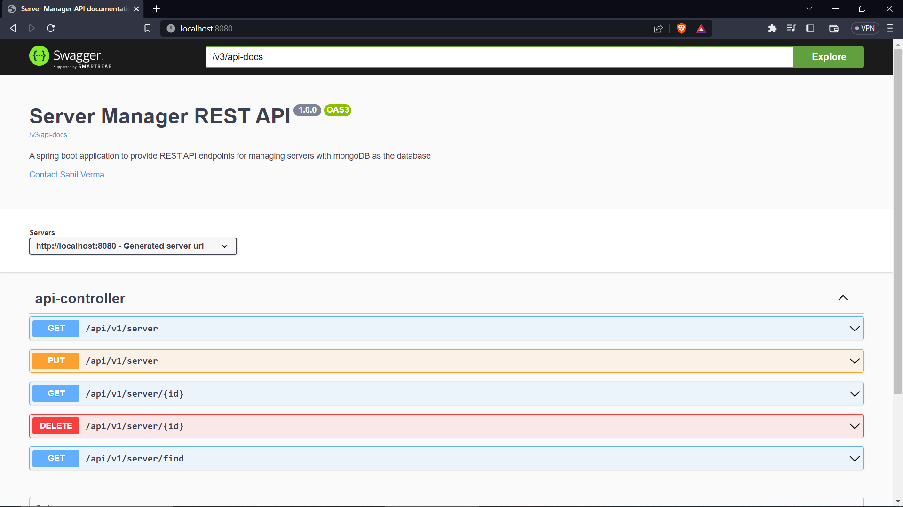
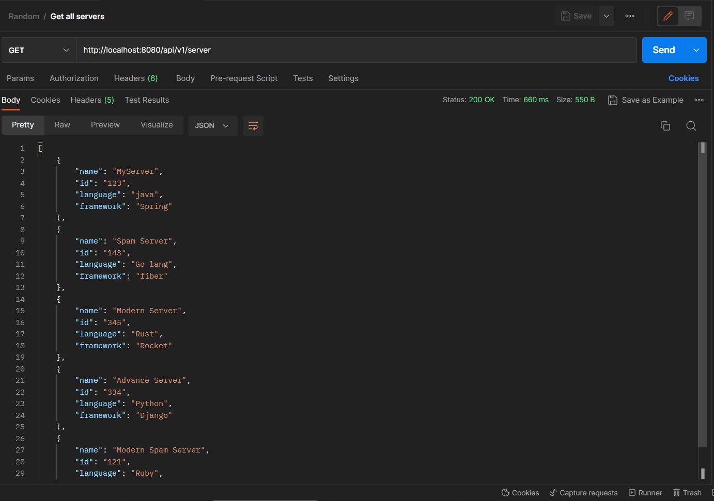
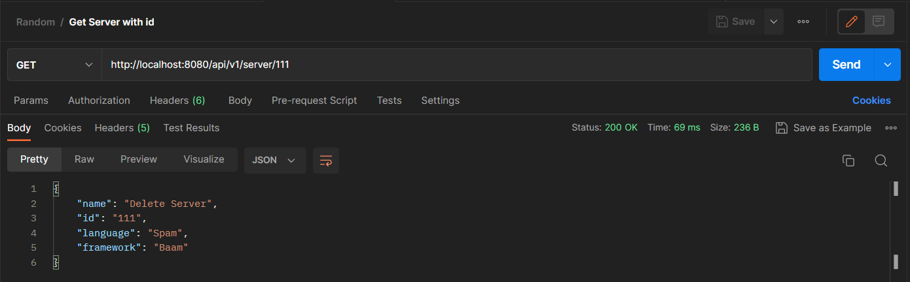
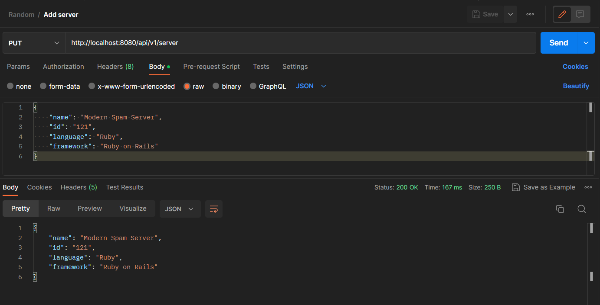
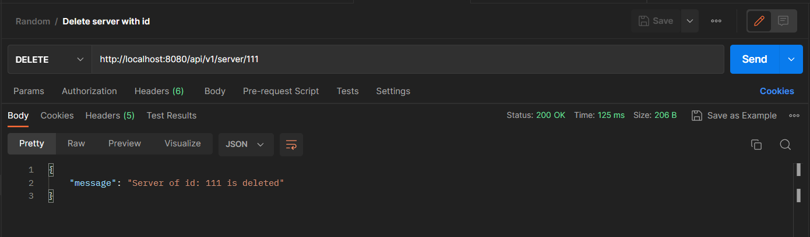
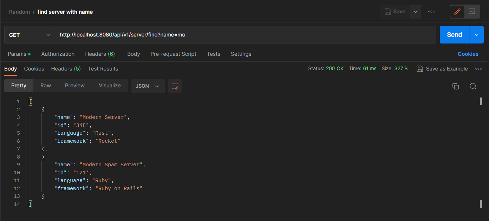

# Server Manager REST API with Swagger codegen
This project is the copy of the project [Keima483/server-manager-rest-api](https://github.com/Keima483/server-manager-rest-api) but this time with swaggers API documentation, so check that project's [README.md](https://github.com/Keima483/server-manager-rest-api/blob/main/README.md) to see how this project works and what are the endpoints. 

## How to access the documentation
To access the documentation just hit on the root(/) endpoint and there you are.
For Example if the project is running on localhost with port 8080 then hit
`http://localhost:8080/` and you will get the documentation.
To achive this functionality of hitting the root instead of `http://localhost:8080/swagger-ui/index.html` i embed `/swagger-ui/index.html` into `index.html` of `\src\main\resources\static`.
## Screenshots 
The screenshots of the Working of APIs are

1. See the Api documentation   
   
2. Get All Servers   
   
3. Get Server By ID   
   
4. Add Or Update a Server   
   
5. Delete A Server   
   
6. Find Server by name   
   
